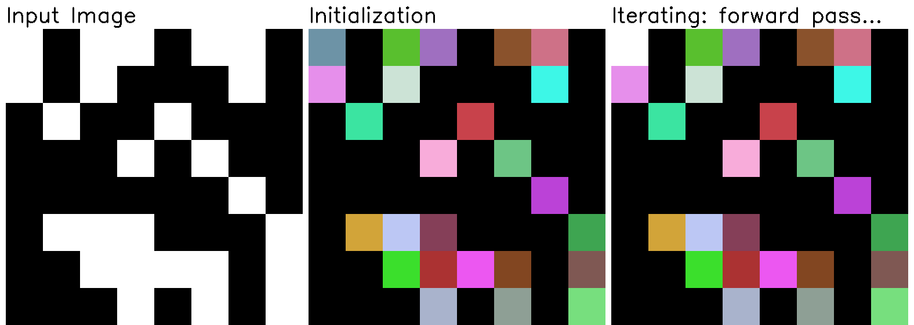

# haralick-labeling-visualized
Visual explanation and python implementation of Haralick algorithm for connected component labeling



**The Haralick labeling algorithm is an iterative algorithm for connected 
 component labeling proposed by [Robert Haralick](https://en.wikipedia.org/wiki/Robert_Haralick)
 in the paper [*Neighborhood Operators*](http://haralick.org/book_chapters/neighborhood_operators.pdf)
 , which dates back to 1981!**

Although it's not a state of the art algorithm for connected component labeling
 for sure, I find it's still suitable for didactic purposes due to its neatness 
 and simplicity .
Furthermore, the algorithm logic *can be implemented with few lines of code*, 
 which IMHO makes it still useful in a few scenarios (interviews anyone?). 
 
Here we provide a visual explanation to see how it works, as well as a python 
 implementation to play with.

### Algorithm description

**The Haralick labeling algorithm iteratively performs forward and backward
 raster scans over the image to solve label equivalences exploiting only 
 local neighborhood information.**

This iterative approach using only local information makes it extremely **resource 
 efficient**, as it does not require additional data structures to work. The downside 
 is that it obviously turns out to be **very slow** as the resolution of the binary
 image to be labelled increases. 

**There are 4 steps the algorithm is composed of**:
1. **Initialization:** Each foreground pixel is assigned a consecutive label.
2. **Forward scan:** Image is iterated top to bottom, left to right sliding 
     a local kernel; to each foreground pixel is assigned the minimum label in
     its local neighborhood (i.e. inside the kernel).
3. **Reverse scan:** Image is iterated bottom to top, right to left; sliding 
     a local kernel; just as in the forward pass, to each foreground pixel is
      assigned the minimum label in its local neighborhood (i.e. inside the kernel).
4. **Repeat** steps 2. and 3. until convergence. Convergence is reached when 
     no pixels change during a whole forward-reverse pass.

Below you can see a toy case in which one forward and one reverse scans suffice for 
 convergence. If you try to mentally slide the kernel on the image assigning the 
 neighborhood minimum to each foreground pixel, it should be easy to see how results
 are produced. 
   


However, as the image get bigger and more complex the number of iterations to converge 
 gets usually very high; this makes Haralick algorithm pretty slow in practice.

#### Few words about neighborhood and pixel connectivity

The **neighborhood** of a pixel is defined by a 3x3 window around the pixel 
 in case of 8-connectivity, and by a cross centered on the pixel in case 
 of 4-connectivity. This implementation assumes 8-connectivity.
 
 

You might have noticed that the kernel depicted above is not a 3x3 kernel, 
 though. In fact, due to the raster scan nature of Haralick algorithm, there
  is no need to always access all 8 pixels in the pixel neighborhood. This 
  simplifies simplify the structure of the kernel from a 3x3 square to a sort of 
 rotated `L`, as shown in the animation on top.
 
### Tinkering with the code

Suggested installation is using a Python virtual environment:
```bash
python3.7 -m venv haralick_visualized
source haralick_visualized/bin/activate
pip install -r requirements.txt
```

Entry point is in [`main.py`](main.py). Try to tinker with the random
 seed to change the starting point, or load your own binary image to
 see how the labeling progresses.
 
Just please keep in mind that the current implementation is created with didactic purposes in mind, so it's pretty slow! There's a lot of overhead
 due to the ongoing visualization.

---

Below you find some other examples generated from different random seed to get a better feeling of how the labels are propagated until convergence.

 
 
 
 
 